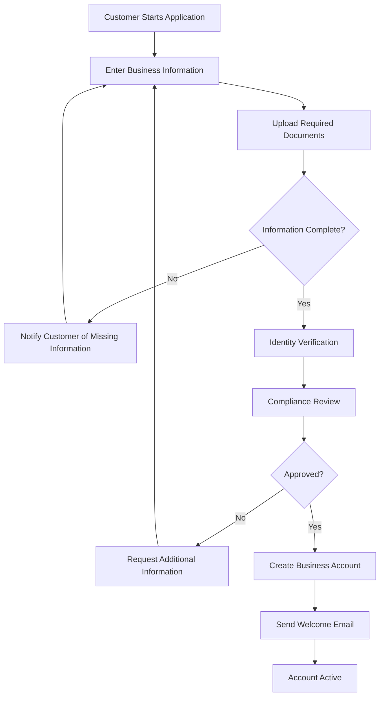

# Business Account Opening Process

```mermaid
flowchart TD
    A[Customer Starts Application] --> B[Enter Business Information]
    B --> C[Upload Required Documents]
    C --> D{Information Complete?}

    D -- No --> E[Notify Customer of Missing Information]
    E --> B

    D -- Yes --> F[Identity Verification]
    F --> G[Compliance Review]
    G --> H{Approved?}

    H -- No --> I[Request Additional Information]
    I --> B

    H -- Yes --> J[Create Business Account]
    J --> K[Send Welcome Email]
    K --> L[Account Active]
```
