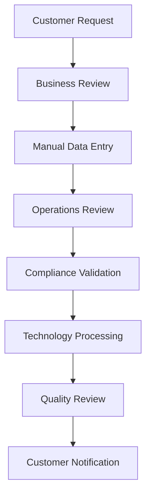

# Current-State Assessment

## Executive Overview

This Current-State Assessment evaluates the existing business processes, technology landscape, operational workflows, and stakeholder challenges associated with a commercial banking account conversion initiative. The assessment establishes a baseline for identifying improvement opportunities and defining the future-state solution.

> **Portfolio Note:** This document is an original example created for professional portfolio purposes. It demonstrates current-state analysis techniques and does not contain confidential or proprietary information from any employer.

---

# Assessment Purpose

The purpose of the current-state assessment is to:

* Understand existing business processes.
* Identify operational inefficiencies.
* Document technology dependencies.
* Capture stakeholder pain points.
* Establish a baseline for future-state design.

---

# Current Environment

The existing operating model supports commercial banking account servicing across multiple business units and technology platforms. As business processes have evolved over time, variations in procedures and supporting systems have increased operational complexity.

Common characteristics include:

* Multiple application touchpoints
* Manual handoffs between teams
* Duplicate data entry
* Inconsistent reporting
* Limited workflow visibility
* Complex stakeholder coordination

---

# Current Business Process

---

# Observed Challenges

## Business

* Duplicate work across teams
* Inconsistent process execution
* Manual approval steps
* Limited process standardization

## Technology

* Legacy system dependencies
* Multiple application interfaces
* Limited automation
* Manual reporting

## Operational

* Processing delays
* Increased exception handling
* Higher operational risk
* Resource-intensive activities

---

# Root Cause Analysis

Primary contributors include:

* Aging technology platforms
* Fragmented business processes
* Manual workflow dependencies
* Inconsistent business rules
* Limited end-to-end visibility

---

# Opportunities for Improvement

* Increase workflow automation.
* Standardize business processes.
* Improve stakeholder communication.
* Enhance reporting capabilities.
* Reduce manual processing.
* Strengthen operational controls.

---

# Business Impact

The current-state environment increases operational complexity, extends processing times, and creates additional risk through manual activities and inconsistent workflows.

Modernizing these processes provides opportunities to improve efficiency, strengthen governance, and enhance the customer experience.

---

# Skills Demonstrated

* Current-State Analysis
* Business Process Assessment
* Business Analysis
* Process Improvement
* Root Cause Analysis
* Technology Assessment
* Operational Analysis
* Executive Communication
