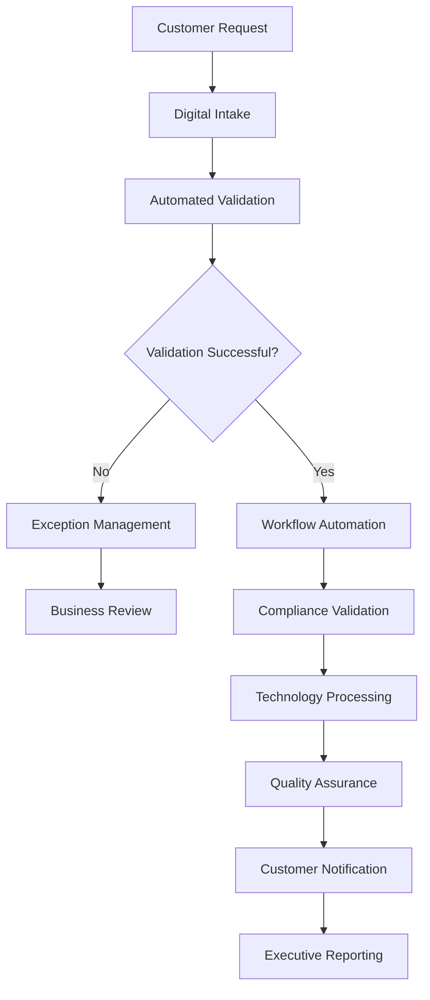

# Future-State Design

## Executive Overview

This Future-State Design presents a modernized business process for commercial banking account conversion activities. The proposed operating model focuses on improving efficiency, reducing operational risk, increasing automation, and enhancing collaboration across business and technology teams.

> **Portfolio Note:** This document is an original example created for professional portfolio purposes. It demonstrates future-state business process design concepts and does not contain confidential or proprietary information from any employer.

---

# Design Objectives

The future-state solution is designed to:

* Standardize business processes.
* Reduce manual processing.
* Improve workflow visibility.
* Increase automation.
* Strengthen governance and controls.
* Enhance customer experience.
* Improve reporting and operational metrics.

---

# Future-State Business Process

---

# Key Improvements

## Business Process

* Standardized workflows
* Reduced manual approvals
* Improved decision consistency
* Faster processing times

## Technology

* Increased automation
* Real-time workflow tracking
* Centralized reporting
* Improved system integration

## Operational

* Reduced exception handling
* Improved resource utilization
* Better operational visibility
* Enhanced service delivery

---

# Expected Business Benefits

| Area                   | Expected Improvement                     |
| ---------------------- | ---------------------------------------- |
| Processing Time        | Reduced through workflow automation      |
| Operational Risk       | Lower through standardized controls      |
| Customer Experience    | Improved transparency and faster service |
| Data Quality           | Increased through automated validation   |
| Reporting              | Enhanced executive visibility            |
| Operational Efficiency | Reduced manual effort and rework         |

---

# Future-State Success Measures

* Increased straight-through processing.
* Reduced manual intervention.
* Improved stakeholder satisfaction.
* Faster cycle times.
* Improved regulatory compliance.
* Greater operational resilience.

---

# Implementation Considerations

Successful implementation requires:

* Executive sponsorship
* Cross-functional collaboration
* Change management
* User training
* Comprehensive testing
* Post-implementation monitoring

---

# Skills Demonstrated

* Future-State Process Design
* Business Process Improvement
* Business Analysis
* Change Management
* Workflow Optimization
* Technology Strategy
* Operational Excellence
* Executive Communication
