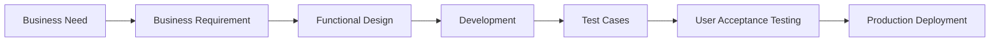

# Requirements Traceability Matrix (RTM)

## Executive Overview

A Requirements Traceability Matrix (RTM) ensures that every business requirement is captured, traced through design and testing, and validated before implementation. It provides visibility into project scope, supports change management, and helps ensure that the delivered solution aligns with business objectives.

> **Portfolio Note:** This document is an original example created for professional portfolio purposes. It demonstrates requirements traceability techniques and does not contain confidential or proprietary information from any employer.

---

# Purpose

The purpose of the RTM is to:

* Ensure complete coverage of business requirements.
* Link requirements to solution components.
* Support testing and validation.
* Improve project governance.
* Facilitate impact analysis when changes occur.

---

# Requirements Traceability Matrix

| Requirement ID | Business Requirement                  | Solution Component   | Test Scenario |   Status   |
| -------------- | ------------------------------------- | -------------------- | ------------- | :--------: |
| BR-001         | Capture complete customer information | Digital Intake Form  | TS-001        | ✅ Complete |
| BR-002         | Validate required fields              | Validation Engine    | TS-002        | ✅ Complete |
| BR-003         | Route exceptions for review           | Workflow Engine      | TS-003        | ✅ Complete |
| BR-004         | Notify stakeholders of status changes | Notification Service | TS-004        | ✅ Complete |
| BR-005         | Maintain audit history                | Audit Logging        | TS-005        | ✅ Complete |
| BR-006         | Produce executive reporting           | Reporting Dashboard  | TS-006        | ✅ Complete |
| BR-007         | Enforce compliance controls           | Compliance Module    | TS-007        | ✅ Complete |
| BR-008         | Track processing metrics              | KPI Dashboard        | TS-008        | ✅ Complete |

---

# Traceability Lifecycle

---

# Benefits

A well-maintained Requirements Traceability Matrix helps project teams:

* Verify all requirements are addressed.
* Reduce implementation risk.
* Support regulatory and audit activities.
* Improve testing coverage.
* Simplify change management.
* Increase stakeholder confidence.

---

# Governance

The Business Analyst is responsible for maintaining the RTM throughout the project lifecycle.

Updates should occur following:

* Requirements changes
* Design changes
* Testing completion
* Production implementation
* Scope modifications

---

# Success Measures

* All business requirements are traced to solution components.
* Test coverage reaches 100% for approved requirements.
* Requirement changes are documented and approved.
* Stakeholders can easily determine implementation status.

---

# Skills Demonstrated

* Requirements Management
* Traceability
* Business Analysis
* Solution Validation
* Governance
* Change Management
* Testing Coordination
* Project Documentation
